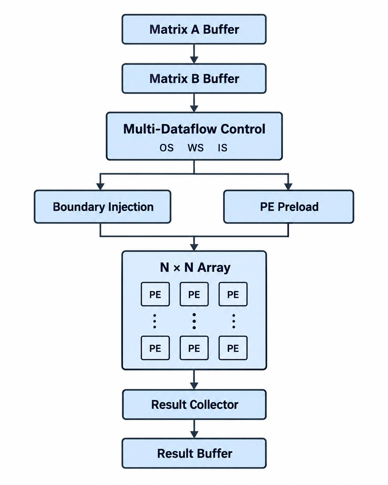
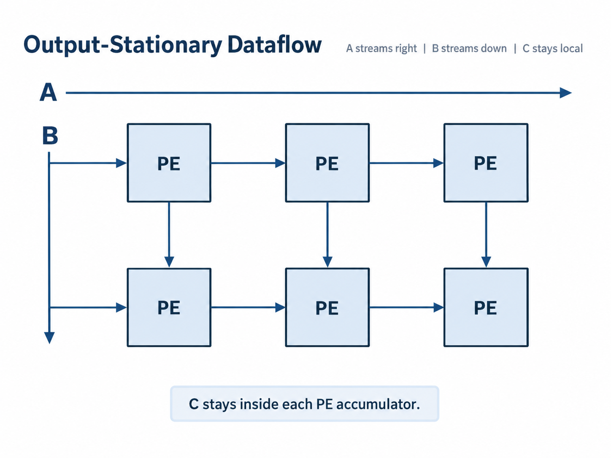
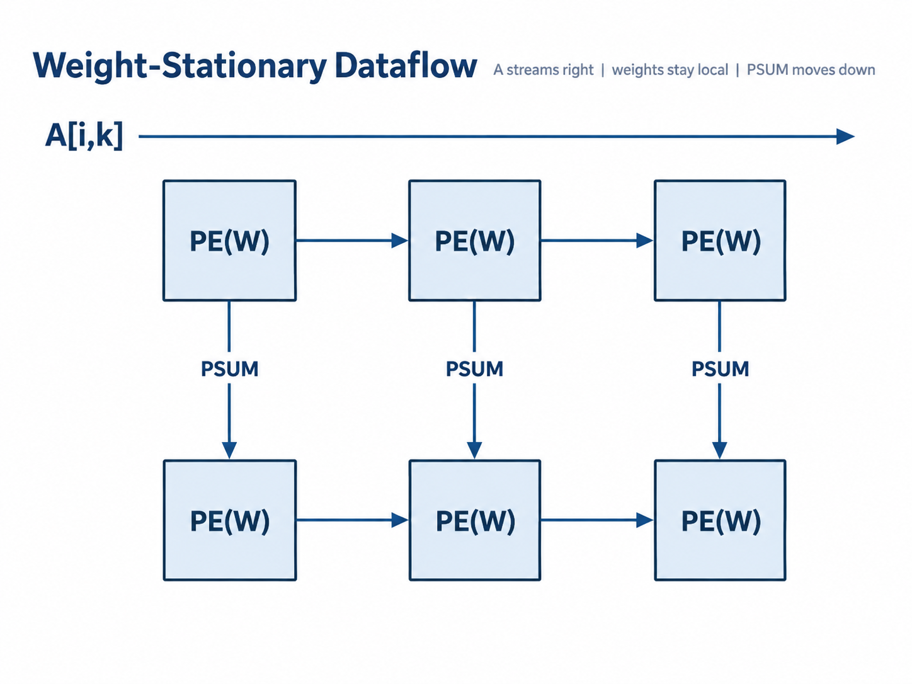
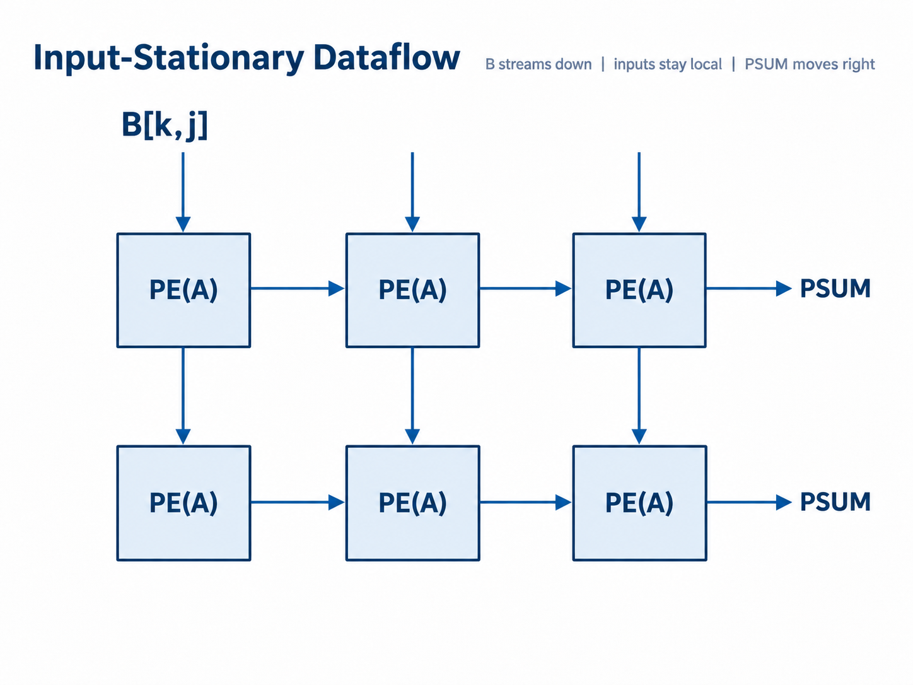
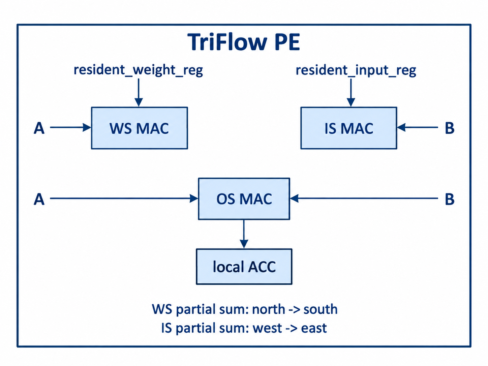
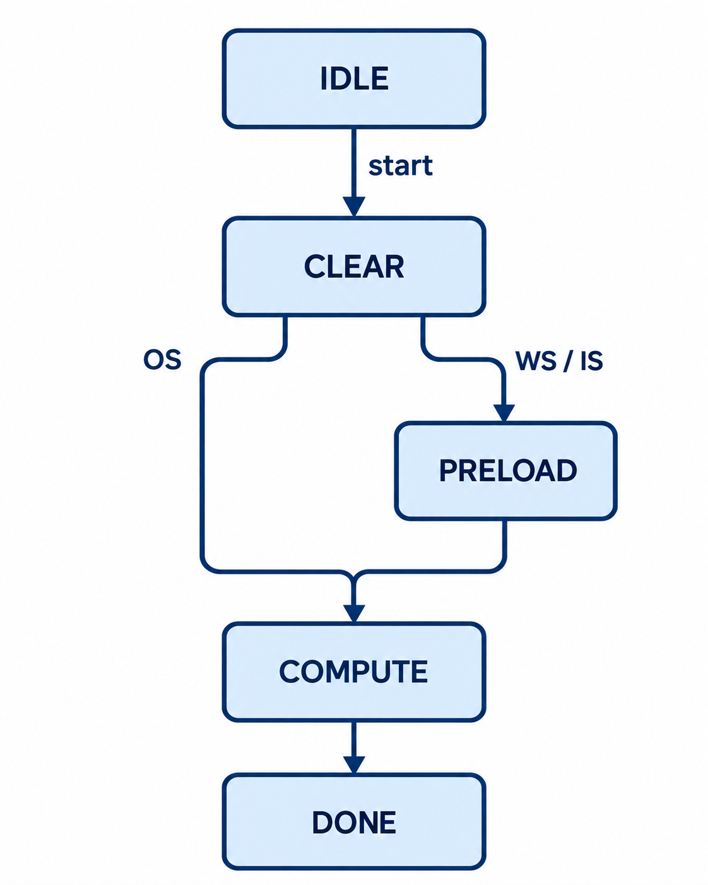

# TriFlow-SA

<p align="center">
  <b>Runtime-Reconfigurable Multi-Dataflow Systolic Array Accelerator</b>
</p>

<p align="center">
  Output-Stationary · Weight-Stationary · Input-Stationary · INT8 MAC · SystemVerilog · Self-Checking Verification
</p>

---

## Overview

**TriFlow-SA** is a parameterized `N x N` systolic-array accelerator that can
switch **at runtime** between three major dataflows:

- **Output-Stationary (OS)**
- **Weight-Stationary (WS)**
- **Input-Stationary (IS)**

The same physical PE fabric is reused in all three modes.

The goal is not only to calculate `C = A x B`, but to expose the architectural
trade-offs created by **where data is kept stationary and where partial sums move**.

This makes TriFlow-SA useful for studying accelerator architectures for:

- CNNs
- GEMM
- Transformers
- attention
- edge AI
- dataflow research
- approximate computing
- FPGA/ASIC design

---

## Top-Level Architecture

<p align="center">
  
</p>

---

# Three Dataflows

## 1. Output-Stationary

Each physical PE owns one output:

```text
PE(i,j) -> C[i][j]
```

Data movement:

<p align="center">
  
</p>

Operation:

```text
ACC[i,j] += A[i,k] * B[k,j]
```

Advantages:

- local partial-sum accumulation
- no inter-PE partial-sum traffic
- natural GEMM mapping

---

## 2. Weight-Stationary

Physical PE `(k,j)` owns:

```text
B[k][j]
```

Data movement:

<p align="center">
  
</p>

- weights remain resident
- A activations move east
- partial sums move south
- bottom edge emits final outputs

This mode is attractive when weights can be reused across many input rows or tiles.

---

## 3. Input-Stationary

Physical PE `(i,k)` owns:

```text
A[i][k]
```

Data movement:

<p align="center">
  
</p>

- inputs remain resident
- B values move south
- partial sums move east
- right edge emits final outputs

This mode is useful when activations have high reuse.

---

# Reconfigurable Processing Element

Each PE contains:

<p align="center">
  
</p>


Mode behavior:

```text
OS:
    acc += A * B

WS:
    psum_south = psum_north + A * resident_weight

IS:
    psum_east  = psum_west + resident_input * B
```

---

## Wavefront Scheduling

All three mappings are designed so matching operands meet at:

```text
cycle = i + j + k
```

For an `N x N` square GEMM:

```text
MAC operations  = N^3
Physical PEs    = N^2
Compute cycles  = 3N - 2
```

For the default `4 x 4` design:

```text
PEs             = 16
MAC operations  = 64
Compute cycles  = 10
Input precision = signed INT8
Accumulator     = signed INT32
```

WS and IS additionally use an `N^2` preload phase in the baseline controller.

That makes the repository useful for studying **preload cost versus stationary-data reuse**.

---

# Control Unit

The controller contains the following states:

<p align="center">
  
</p>

The mode controls:

- resident-register loading
- boundary operand injection
- partial-sum direction
- result capture
- performance counters

---

## Repository Structure

```text
TriFlow-SA/
│
├── rtl/
│   ├── triflow_pkg.sv
│   ├── triflow_pe.sv
│   ├── triflow_array.sv
│   ├── triflow_controller.sv
│   ├── matrix_buffer.sv
│   ├── result_buffer.sv
│   ├── result_collector.sv
│   └── triflow_top.sv
│
├── tb/
│   └── tb_triflow_top.sv
│
├── sw/
│   ├── golden.py
│   └── schedule_demo.py
│
├── docs/
│   ├── architecture.md
│   ├── pe.md
│   └── experiments.md
│
├── scripts/
│
├── assets/
│
├── .github/
│   └── workflows/
│       └── ci.yml
│
├── Makefile
├── LICENSE
├── .gitignore
└── README.md
```

---

# Golden Test

The included verification uses:

```text
A =
[  1   2   3   4 ]
[  5   6   7   8 ]
[ -1   2  -3   4 ]
[  8   0   1  -2 ]

B =
[ 1   0   2  -1 ]
[ 3   1   0   2 ]
[ 2  -2   1   1 ]
[ 0   4  -1   3 ]
```

Expected:

```text
C =
[ 13   12    1   18 ]
[ 37   24    9   38 ]
[ -1   24   -9   14 ]
[ 10  -10   19  -13 ]
```

The self-checking testbench runs the same matrices through:

```text
Output-Stationary
Weight-Stationary
Input-Stationary
```

and requires all three modes to produce the identical GEMM result.

---

# Performance Counters

The top level exposes:

```text
perf_total_cycles
perf_compute_cycles
perf_preload_cycles
perf_mac_ops
```

This makes it easy to compare dataflows.

A useful metric is:

```text
Effective MAC/cycle =
N^3 / total_cycles
```

For repeated tiles, you can extend the controller to reuse resident weights or
inputs and amortize preload cost.

---

# Quick Start

Requirements:

```text
Python 3
Icarus Verilog
GNU Make
GTKWave (optional)
```

Ubuntu/Debian:

```bash
sudo apt update
sudo apt install python3 make iverilog gtkwave
```

Run the software golden model:

```bash
make test-sw
```

Run RTL:

```bash
make sim
```

Inspect the waveform:

```bash
gtkwave triflow.vcd
```

---

# Verification

The SystemVerilog testbench verifies:

- host matrix loading
- OS scheduling
- WS resident-weight preload
- IS resident-input preload
- signed INT8 multiplication
- INT32 accumulation
- all 16 output elements
- identical results across all dataflows
- performance counter behavior

The Python model independently validates the mathematical mapping.

---

# Why This Project Is Interesting

Many systolic-array repositories implement only one fixed dataflow.

TriFlow-SA asks a more architectural question:

> **How does the same compute fabric behave when the stationary operand changes?**

The design therefore exposes:

- data reuse
- operand movement
- partial-sum movement
- preload overhead
- dataflow scheduling
- PE reconfiguration
- cycle-level control
- hardware/software co-verification

That makes it a stronger portfolio project for **AI accelerator architecture**.

---

# Research Extensions

Interesting next versions:

### Memory system

- dual-bank SRAM
- double buffering
- tiled GEMM
- DMA engine
- AXI4 interfaces

### Dataflow research

- reuse resident weights across multiple tiles
- reuse resident inputs across multiple tiles
- automatic dataflow selection
- cost-model-based scheduler
- mixed dataflows across layers

### Precision

- INT4
- INT8
- BF16
- mixed precision

### Optimization

- zero skipping
- sparsity
- clock gating
- operand gating
- approximate arithmetic

### AI workloads

- CNN convolution
- Transformer linear layers
- Q/K/V projection
- `QK^T`
- attention `PV`
- MLP / FFN layers

### ASIC / FPGA

- Yosys synthesis
- OpenROAD physical design
- FPGA implementation
- PPA comparison
- energy per MAC
- dataflow-aware power analysis

---

## Author

### Matin Firoozbakht

<p align="center">
  <a href="https://github.com/matinfirooz">
    github.com/matinfirooz
  </a>
</p>

---

<p align="center">
  <b>TriFlow-SA — One array. Three dataflows.</b>
</p>
